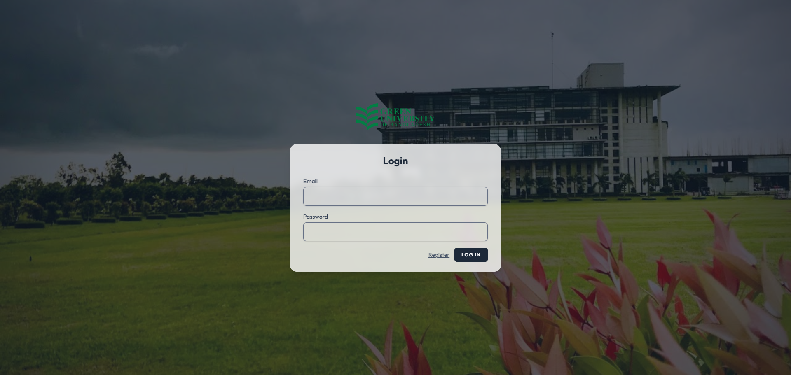
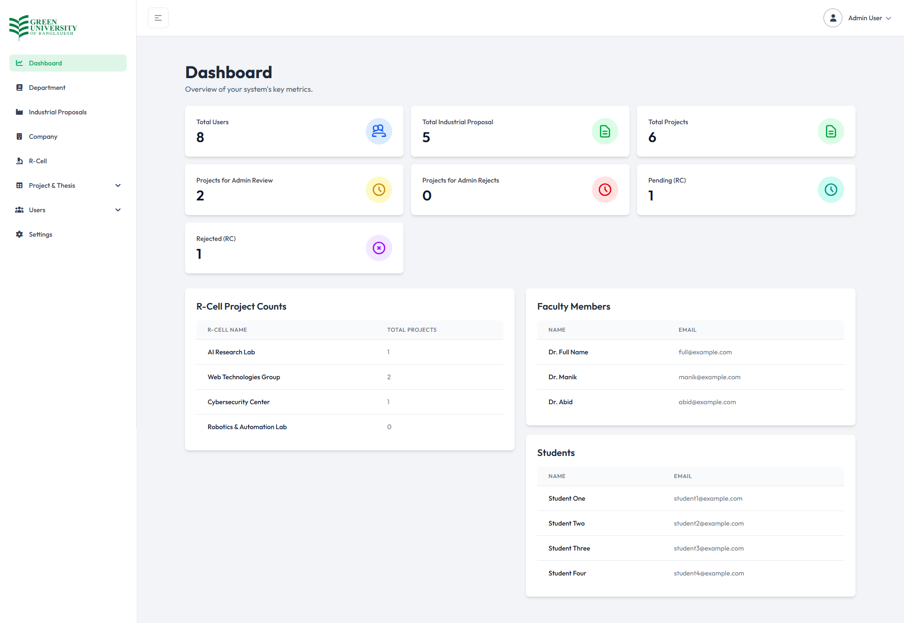

# Project Proposal Management System

## About The Project

This is a web application designed to streamline the process of submitting, managing, and approving project proposals within an academic or research-oriented institution. The system provides a clear and organized workflow for students, faculty members, and administrators, ensuring that all proposals are handled efficiently.

## Application Preview / Screenshots

### 1. Login Page


**Key Features & Details:**
- **Branding & Layout:** Styled layout displaying the institution logo (Green University of Bangladesh) and system heading.
- **Authentication Credentials:** Fields for Email/Username and Password with validation support.
- **Session & Recovery Controls:** Includes "Remember me" option, "Forgot your password?" recovery link, and "Sign in" action.
- **User Onboarding:** Direct link to registration page ("Sign up now").

---

### 2. Dashboard


**Key Features & Details:**
- **Sidebar Navigation:** Easy access to key system modules including Dashboard, Department, Industrial Proposals, Company, R-Cell, Project & Thesis, Users, and Settings.
- **Analytical Metrics Cards:** Overview stats for Total Users, Total Industrial Proposals, Total Projects, Projects for Admin Review, Admin Rejections, Pending Research Cell (RC) reviews, and RC Rejections.
- **R-Cell Project Counts:** Table presenting proposal counts across various research labs (e.g., AI Research Lab, Web Technologies Group, Cybersecurity Center, Robotics & Automation Lab).
- **User Directories:** Quick-view lists showing registered Faculty Members and Students with their names and email addresses.

---

### 3. Project Proposal Details


**Key Features & Details:**
- **Proposal Information Header:** Displays Proposed Title (e.g., *AI-Powered Chatbot for University Support*), Department, Academic Year, Semester, Course Title, Course Code, and Course Type.
- **Problem & Motivation:** Section detailing the problem statement and the core motivation behind the research/project.
- **Supervisor & Status Tracking:** Highlights assigned Research Lab, Supervisor Name, Submitter Info, and status indicator badge (e.g., `Pending Research Cell`).
- **Group Members List:** Structured table presenting member names, Student IDs, Email addresses, and Phone numbers.
- **Navigation Controls:** Convenient "Back to Project List" button for returning to the main list view.

---

## Features

The application offers a range of features tailored to different user roles:

### Admin
- **User Management:** Create, view, edit, and delete user accounts.
- **Department Management:** Manage academic departments.
- **Company Management:** Keep a record of partner companies.
- **R-Cell Management:** Manage research cells.
- **Settings:** Configure application settings.
- **Proposal Management:** View, approve, reject, and delete project proposals.
- **Bulk Actions:** Approve or delete all proposals at once.

### Faculty Member
- **Proposal Review:** View and approve or reject project proposals submitted by students.
- **Bulk Approval:** Approve all pending proposals with a single action.

### Student
- **Proposal Submission:** Create and submit new project proposals, including industrial proposals.
- **View Proposals:** Track the status of submitted proposals.

## Technology Stack

The application is built using a modern technology stack:

- **Backend:**
  - PHP 8.2
  - Laravel 12
  - Composer for package management
- **Frontend:**
  - Vite.js
  - Tailwind CSS
  - Alpine.js
- **Database:**
  - SQLite (or other Laravel-supported databases like MySQL, PostgreSQL)

## Workflow

1.  **User Registration & Login:** Users register and log in to the system. Roles are assigned by an administrator.
2.  **Proposal Submission:** Students fill out a form to submit their project proposals. Industrial proposals have a separate submission form.
3.  **Proposal Review:** Faculty members and administrators can view the submitted proposals in their dashboard.
4.  **Approval/Rejection:**
    - Faculty members can approve or reject proposals.
    - Admins have full control over proposals, including the ability to delete them.
5.  **Status Tracking:** Students can see the status of their proposals (pending, approved, rejected) in their dashboard.

## Getting Started

To get a local copy up and running, follow these simple steps.

### Prerequisites

- PHP >= 8.2
- Composer
- Node.js & npm
- A database server (e.g., MySQL, PostgreSQL, or SQLite)

### Installation

1.  **Clone the repo**
    ```sh
    git clone https://github.com/your_username/your_repository.git
    ```
2.  **Install PHP dependencies**
    ```sh
    composer install
    ```
3.  **Install NPM packages**
    ```sh
    npm install
    ```
4.  **Create a copy of your .env file**
    ```sh
    cp .env.example .env
    ```
5.  **Generate an application key**
    ```sh
    php artisan key:generate
    ```
6.  **Configure your database**
    - Open the `.env` file and set your database credentials.
    - If using SQLite, create the database file:
      ```sh
      touch database/database.sqlite
      ```
7.  **Run the database migrations**
    ```sh
    php artisan migrate
    ```
8.  **Run the development server**
    - The following command will start the PHP server, the queue listener, and the Vite development server concurrently:
      ```sh
      composer run dev
      ```
9.  **Access the application**
    - Open your browser and navigate to `http://127.0.0.1:8000`.
